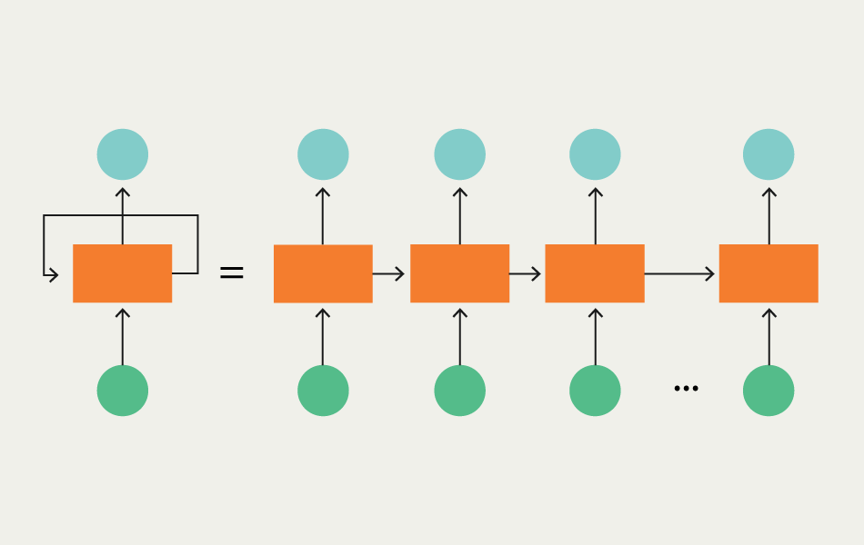

# Stock Price Prediction with LSTM

## Overview

This project aims to create a Long Short-Term Memory (LSTM) neural network to predict stock prices using historical stock market data. The dataset used in this project is sourced from Kaggle, available at [Kaggle](https://www.kaggle.com/datasets/jacksoncrow/stock-market-dataset).

## Dataset

The dataset contains historical stock market data, including Open, High, Low, Close (OHLC) prices, volume, and other technical indicators. The dataset is organized in a tabular format with each row representing a daily record for a specific stock. The columns in the dataset are:

- Date: The date of the stock record.
- Open: The opening price of the stock on that day.
- High: The highest price the stock reached during the day.
- Low: The lowest price the stock reached during the day.
- Close: The closing price of the stock on that day.
- Volume: The trading volume of the stock on that day.
- SMA9: The Simple Moving Average over 9 periods, indicating the average price over the short term.
- SMA20: The Simple Moving Average over 20 periods, providing a medium-term average price.
- BBUP: The upper Bollinger Band, calculated as the middle band (e.g., SMA20) plus a specified number of standard deviations (2).
- BBDOWN: The lower Bollinger Band, calculated as the middle band (e.g., SMA20) minus a specified number of standard deviations (2).

## Problem Definition

The primary goal of this project is to build a predictive model using LSTM neural networks to forecast future stock prices based on historical data. The problem is defined as a time-series prediction task where the input is a sequence of historical stock prices, and the output is the predicted stock price for a future time point.

## Recurrent Neural Networks (RNN)
Recurrent Neural Networks (RNN) are a class of neural networks designed for sequential data processing. Unlike traditional feedforward neural networks, RNNs have connections that create cycles in the network, allowing them to maintain a hidden state. This hidden state enables RNNs to capture information from previous inputs and use it to influence future predictions. However, vanilla RNNs often face challenges in retaining long-term dependencies due to the vanishing gradient problem.



## Long Short-Term Memory (LSTM)
Long Short-Term Memory (LSTM) is a specialized type of RNN that addresses the vanishing gradient problem. LSTMs introduce memory cells with self-connected gates, allowing them to selectively remember or forget information over long sequences. The architecture includes input, output, and forget gates, each serving a crucial role in information flow. LSTMs have proven effective in capturing and learning patterns from sequential data, making them particularly suitable for time-series prediction tasks.


### Key Features of LSTM:
- Cell State: The memory that runs through the entire sequence, allowing LSTMs to capture long-term dependencies.
- Input Gate: Regulates the flow of information into the cell state.
- Forget Gate: Controls what information to discard from the cell state.
- Output Gate: Determines the output based on the current input and the memory from the cell state.

## Data Preprocessing
### Stationarity problem
Stationarity is a crucial concept in time series analysis, especially when working with financial data. A time series is considered stationary when its statistical properties, such as mean and variance, remain constant over time. Stationarity is essential for many statistical models, including those used in predicting stock prices. Non-stationary data can introduce challenges in model training and lead to unreliable predictions.

Financial time series data often exhibits non-stationary behavior due to trends, seasonality, or other underlying patterns. This non-stationarity can make it challenging to apply traditional modeling techniques, as the statistical properties of the data change over time. In the context of stock prices, trends and volatility may vary, making it difficult for models to learn consistent patterns.

### Log returns to fix stationarity

To address the issue of non-stationarity, we use log returns. Log returns are calculated by taking the natural logarithm of the ratio of the current price to the previous price. The use of logarithms has several advantages:

- Stabilizing Variance: Log returns transform multiplicative changes into additive changes, which helps stabilize the variance of the time series. This is beneficial for models that assume constant variance.
- Normalizing Trends: By focusing on relative changes rather than absolute values, log returns mitigate the impact of trends in the data. This makes the time series more amenable to modeling techniques that assume stationary behavior.
- Interpretability: Log returns are interpretable as percentage changes, providing a meaningful way to understand the magnitude of price movements.


## Dependencies
Python: 3.8.18

```bash
pip install -r requirements.txt
```

1. Clone this repository:
```
git clone https://github.com/whyhideki/Pytorch-Finance
cd Pytorch-Finance
```

2. Download the dataset from [Kaggle](https://www.kaggle.com/datasets/jacksoncrow/stock-market-dataset) and extract its contents to the project's root directory. Ensure that the dataset is organized within a folder named "stocks," and it should include the necessary CSV files

3. Run the Jupyter notebook to execute the code.

```
jupyter notebook stock_price_prediction.ipynb
```
